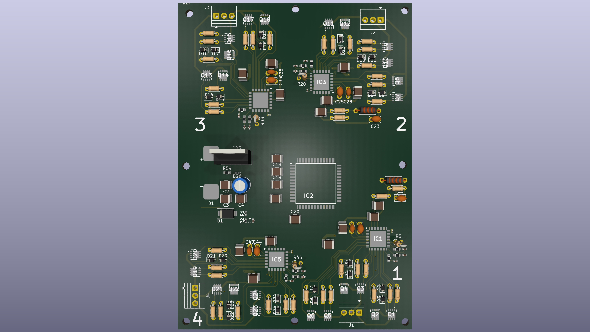
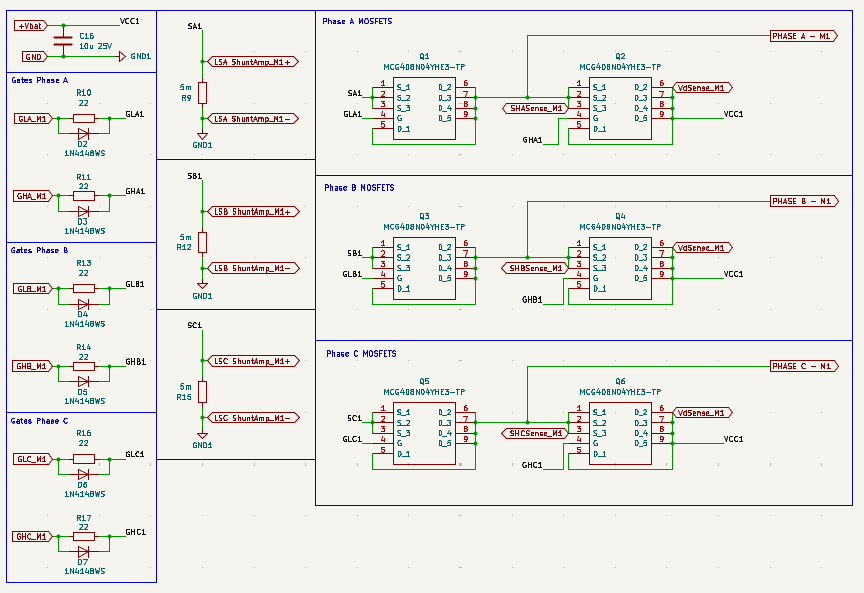

# 4-in-1 Quadcopter ESC (STM32F407 + DRV8323RS)

**High-performance 4-in-1 Electronic Speed Controller** for BLDC motors in quadcopters/drones.

## Specifications
- **Battery**: 4S LiPo (5.2Ah 35C/60C)
- **Motor**: 1400KV BLDC, ~7A max efficient current per motor
- **MOSFET**: MCG4D8N04YHE3-TP (x12 for 4-in-1)
- **Gate Driver**: DRV8323RS (x4)
- **MCU**: STM32F407VET6
- **Layout**: 4-in-1 ESC board
- **Firmware**: Custom (in development) — supports [target protocol, e.g., DShot, PWM]

## Features
- 4 independent 3-phase half-bridges
- High-current power stage optimized for 4S
- SPI / UART interface for configuration and telemetry
- Current sensing & protection

## Project Status
- Schematic V2 complete (multi-motor sheets)
- PCB layout in progress (see attached files)
- Firmware skeleton in development

## Repository Contents
- `project files (kicad)/` — KiCad 8+ schematic + PCB files
- `docs/` — Schematics PDF, BOM, images

## Quick Start
1. Clone repo
2. Open `hardware/ESC_4in1.kicad_pro` in KiCad
3. Review power stage, gate driver, and MCU sections
4. Generate Gerbers for manufacturing

## Firmware
(Instructions coming soon — STM32CubeIDE / PlatformIO)

## Contributing
Contributions welcome! See [CONTRIBUTING.md](CONTRIBUTING.md) (create later).

## License
MIT License — see [LICENSE](LICENSE) file.
